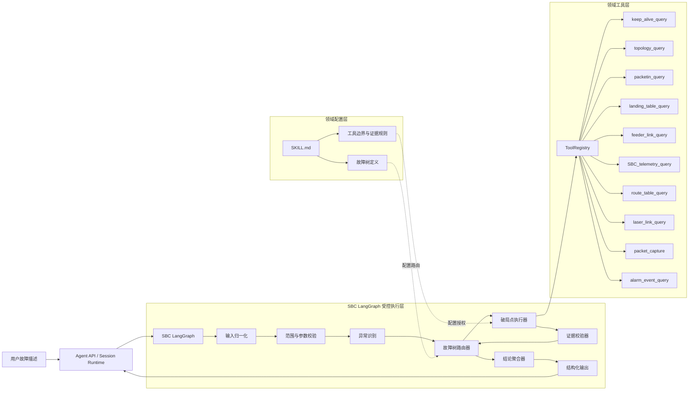
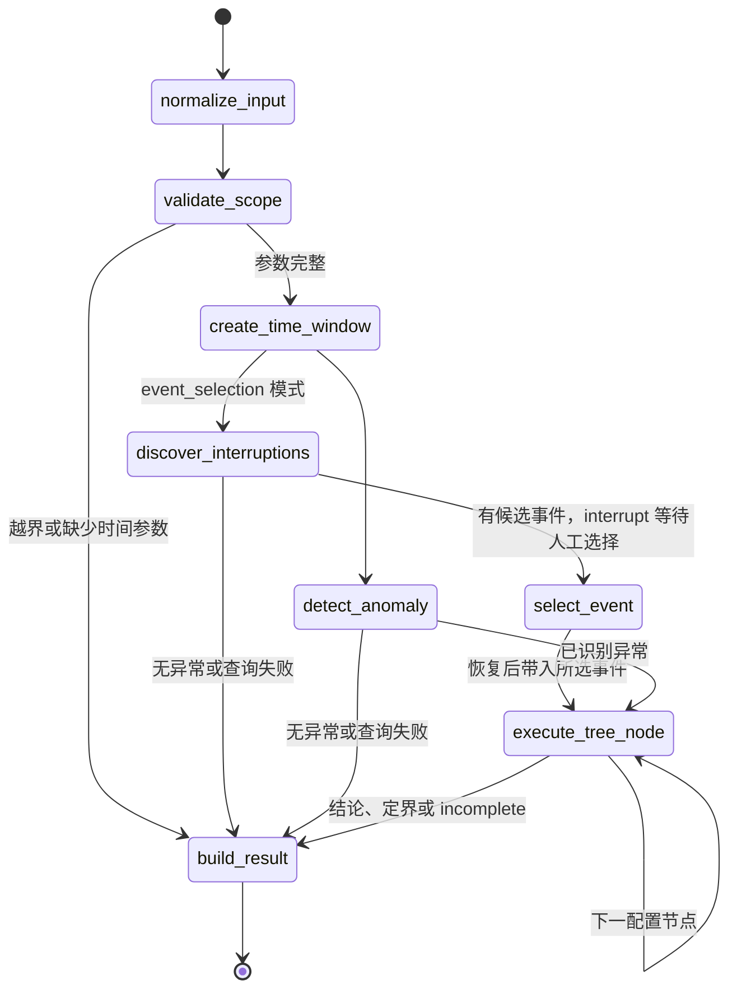
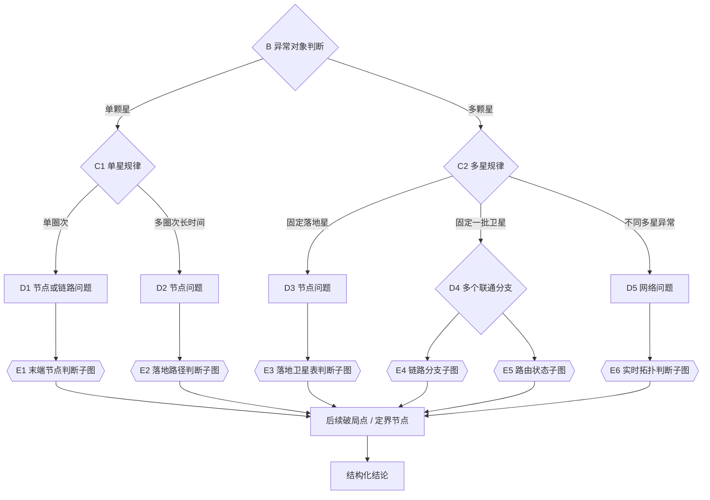
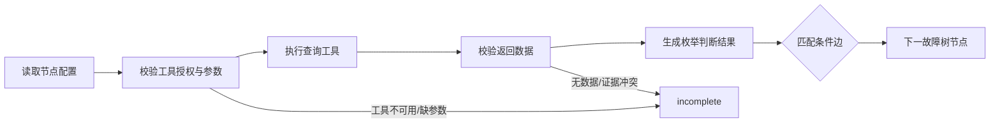
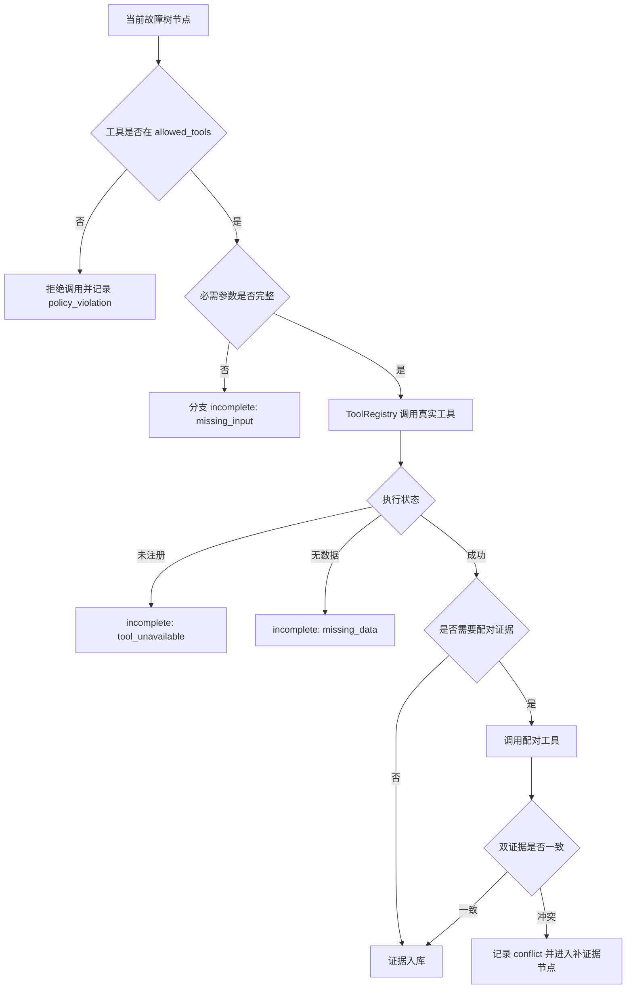
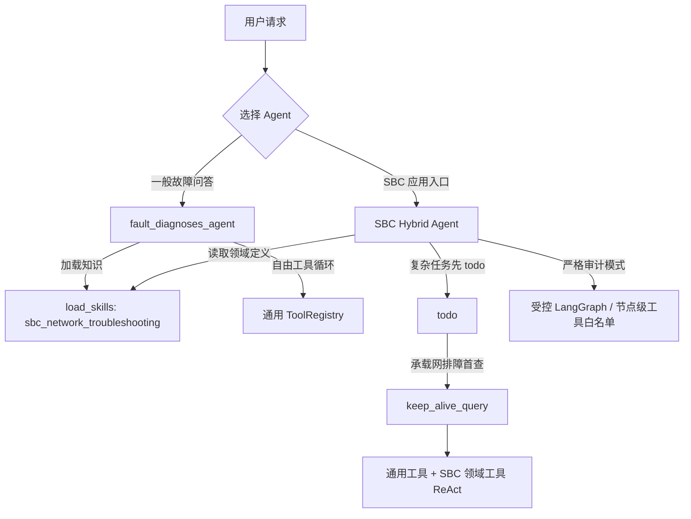

# SBC Network Troubleshooting Agent：LangGraph 设计草图

> 实施状态（2026-09）：受控 LangGraph、配置化故障树、证据门禁、人工事件选择和 SQLite 模拟数据工具均已实现，见 [backend/agents/sbc_network_troubleshooting/](../backend/agents/sbc_network_troubleshooting)。第 3 节按当前代码中的实际图节点描述；第 4 节是运行时配置展开后的领域逻辑视图。

## 1. 设计目标

`SBC_network_troubleshooting_agent` 是面向天基承载网故障排查的专用智能体。它不替代
`skills/sbc_network_troubleshooting/SKILL.md`，而是把 skill 中的故障树、工具边界和证据要求
转化为可执行、可恢复、可审计的 LangGraph 流程。

核心原则：

1. **图控制流程，模型辅助判断。** 分支、必查项、停止条件由图约束，不让模型任意跳过节点。
2. **证据先于结论。** 每个破局点必须关联工具证据或明确的数据缺失记录。
3. **工具按节点授权。** 节点只能调用该节点允许的工具，不能使用通用 ReAct 循环任意选工具。
4. **缺失即停止当前分支。** 工具不可用、参数不足或查询无数据时，将分支标记为 `incomplete`，不猜测结论。
5. **结构化结果优先。** 图的产物是排查轨迹和结构化结论；用户明确要求报告时，由外层 Service 基于结构化结果生成报告，不在图内重新诊断。

## 2. 总体架构



> `SBCNetworkTroubleshootingService` 当前通过 `build_sqlite_handlers()` 默认注册 SBC 领域工具，数据源是模拟 SQLite 数据库；调用方也可注入 handler 覆盖默认实现。独立实例化空的 `SBCDomainToolRegistry` 时，未注册工具仍产生 `tool_unavailable`，流程不得伪造结果。

## 3. 主图执行流程

主图只保留稳定的执行阶段。原故障树中的 `E1`、`F1`、`H17` 等具体节点均由
`execute_tree_node` 读取 `SKILL.md` 中的 `yaml sbc-tree` 配置并循环执行。报告生成不在 LangGraph 节点内完成，而由外层 Service 根据结构化结果生成并登记产物。



### 节点职责

| 节点 | 类型 | 职责 | 是否允许模型自由决策 |
| --- | --- | --- | --- |
| `normalize_input` | 确定性代码 + 结构化提取 | 提取故障时间、卫星、地面站、现象和报告诉求 | 仅允许提取字段 |
| `validate_scope` | 确定性代码 | 限制为天基承载网问题，校验必需参数 | 否 |
| `create_time_window` | 确定性代码 | 默认生成故障前后 10 分钟查询窗口 | 否 |
| `detect_anomaly` | 受控工具节点 | 调用 `keep_alive_query` 识别中断对象和时间段 | 否 |
| `discover_interruptions` | 受控工具节点 | 在事件选择模式查询候选中断；无异常时结束，有候选时进入人工选择 | 否 |
| `select_event` | LangGraph interrupt 节点 | 暂停并等待人工选择候选事件，恢复后校验所选事件 | 否 |
| `execute_tree_node` | 配置驱动的循环节点 | 处理分类、路由、定界、破局点和结论；在破局点内完成工具授权、调用、证据校验和下一边选择 | 受节点配置限制 |
| `build_result` | 确定性代码 | 汇总状态、轨迹、证据、定界节点和结论为结构化结果 | 否 |

外层 `SBCNetworkTroubleshootingService` 负责 SQLite checkpointer、混合 ReAct 路径、事件选择恢复、运行记录和可选 Markdown 报告产物，不属于上述 LangGraph 节点。

## 4. 故障树如何映射为图



每个双边框节点都是一个统一结构的“破局点子图”：



节点配置保存在 `SKILL.md` 的 `yaml sbc-tree` 代码块中，并由运行时直接加载，例如：

```yaml
E2:
  type: breakpoint
  label: 破局点：确认拓扑查询结果有无落地路径
  tools: [topology_query]
  outcomes:
    path_found: F3
    path_missing: F4
E3:
  type: breakpoint
  label: 破局点：落地卫星表配置状态是否响应
  tools: [landing_table_query, feeder_link_query]
  required_evidence_groups:
    - [landing_table_query, feeder_link_query]
  outcomes:
    responded: F5
    not_responded: F6
```

`graph.py` 在每轮执行前重新加载并校验该 YAML，因此不会维护第二份 Python 故障树。
Mermaid 图也从相同 YAML 自动生成，仅作为展示视图。

## 5. Agent State

```python
from typing import Literal, TypedDict


class Evidence(TypedDict):
    evidence_id: str
    tree_node_id: str
    tool_name: str
    query_args: dict
    observed_at: str
    result: dict
    status: Literal["valid", "missing_data", "tool_unavailable", "conflict"]


class TraversalStep(TypedDict):
    tree_node_id: str
    node_type: Literal["classification", "breakpoint", "boundary", "conclusion"]
    decision: str
    evidence_ids: list[str]
    next_node_id: str | None


class SBCTroubleshootingState(TypedDict):
    session_id: str
    user_query: str
    fault_time: str
    start_time: str
    end_time: str
    affected_objects: list[str]
    normalized_symptom: str
    current_tree_node_id: str
    traversal: list[TraversalStep]
    evidence: list[Evidence]
    boundary_nodes: list[str]
    conclusion_nodes: list[str]
    status: Literal[
        "running",
        "completed",
        "incomplete",
        "no_anomaly",
        "out_of_scope",
    ]
    missing_inputs: list[str]
    incomplete_reason: str | None
    report_requested: bool
    structured_result: dict | None
```

State 中必须保存 `current_tree_node_id` 和完整 `traversal`，以便使用 LangGraph checkpointer
在工具超时、人工补参或进程重启后从原节点恢复，而不是重新执行整棵树。

## 6. 工具约束与证据门禁



必须在图层强制执行的规则：

- `landing_table_query` 与 `feeder_link_query` 是配对证据，缺少任一结果不得通过该门禁。
- `keep_alive_query` 只能证明异常及时间，不能独立形成根因结论。
- `alarm_event_query` 只能作为线索，必须由设备、拓扑或链路证据确认。
- `packetin_query` 只能校验事件时序，不能替代拓扑或路由判断。
- `SBC_telemetry_query` 必须带明确参数名；禁止由模型臆造遥测参数。该工具查询 SBC 数据库，与 FD 的 `telemetry_query` 技能及其调用的 `data_query` 工具独立。
- `packet_capture` 必须限定接口和短时间窗，建议不超过 120 秒。
- `web_search` 不进入 SBC 现场证据链。
- 当前节点未授权的工具调用由运行时直接拒绝，而不是只靠 prompt 提醒。

## 7. 结构化输出

```json
{
  "status": "completed",
  "fault_window": {
    "start": "2008-08-08 07:50:00",
    "end": "2008-08-08 08:10:00"
  },
  "affected_objects": ["SAT-A", "SAT-B"],
  "breakpoints": [
    {
      "node_id": "E6",
      "decision": "not_connected",
      "evidence_ids": ["ev-001"]
    },
    {
      "node_id": "H17",
      "decision": "packetin_time_matched",
      "evidence_ids": ["ev-002"]
    }
  ],
  "boundaries": [
    {
      "node_id": "F10",
      "scope": "link"
    }
  ],
  "conclusions": [
    {
      "node_id": "I16",
      "summary": "链路中断，路由无法自行恢复",
      "confidence": "high",
      "evidence_ids": ["ev-001", "ev-002"]
    }
  ],
  "incomplete_reason": null
}
```

如果工具不可用或数据缺失，输出应明确失败位置：

```json
{
  "status": "incomplete",
  "current_tree_node_id": "E3",
  "incomplete_reason": "landing_table_query is not registered",
  "missing_evidence": ["landing_table_query", "feeder_link_query"],
  "conclusions": []
}
```

## 8. 推荐代码结构

```text
backend/
  agents/
    sbc_network_troubleshooting/
      __init__.py
      graph.py              # StateGraph 装配、条件边和编译
      state.py              # SBCTroubleshootingState
      tree_schema.py        # 故障树 Pydantic Schema 与图完整性校验
      skill_tree_loader.py  # 从 SKILL.md 读取 yaml sbc-tree
      mermaid_renderer.py   # 从同一 YAML 生成 Mermaid
      evidence.py           # 证据校验和配对规则
      config.py             # 工具目录与运行时加载入口
      sqlite_handlers.py    # 仿真 SQLite 的十个只读领域工具
      observation_rules.py  # 结构化观测/初筛规则
      service.py            # 通用 ReAct 与领域工具的混合编排入口
  tools/
    registry.py             # 继续复用统一工具注册入口
    sbc/                    # SBC 领域工具实现
      keep_alive_query_tool.py
      topology_query_tool.py
      packetin_query_tool.py
      landing_table_query_tool.py
      feeder_link_query_tool.py
      SBC_telemetry_query_tool.py
      route_table_query_tool.py
      laser_link_query_tool.py
      packet_capture_tool.py
      alarm_event_query_tool.py
```

## 9. 与现有通用 Agent 的关系



- 通用 `fault_diagnoses_agent` 保持现有“模型自主调用工具 + 动态加载 skill”的灵活模式。
- SBC 服务入口采用混合模式：继承通用 Agent 的模型工具循环、skill、todo、文件与数据查询能力，
  同时加入十个 SQLite 领域工具。
- 复杂任务第一步强制创建 todo；涉及承载网、保活、落地、馈电、星间或激光链路时，
  第一个实质诊断工具强制为 `keep_alive_query`，先验证中断事实，再开放其他工具。
- 原受控 LangGraph 保留为严格审计模式及故障树回归基础；不再承担所有用户请求的唯一入口。
- 月度范围、模糊时间及能源/热控等非承载网问题交给通用 ReAct 路径，不再因缺少单点
  `fault_time` 直接拒绝。

## 10. 实施状态与后续补强

以下条目是原实施顺序；1～5 的主体能力以及 SQLite checkpointer、人工事件选择恢复均已落地。工具超时/重试策略和“每个结论节点至少一个回归样例”的完整覆盖仍需补强。

1. 将 skill 中的故障树节点整理为 `yaml sbc-tree`，并为每条边定义有限枚举结果。
2. 先实现 `state.py`、主图和一个通用破局点子图，不接真实数据源。
3. 接入 `keep_alive_query` 和 `topology_query`，打通 `A → B → D → E` 最短路径。
4. 接入落地表与馈电链路配对工具，加入双证据门禁。
5. 逐步接入路由、激光、PacketIn、遥测和抓包工具。
6. 增加 checkpointer、人工补参恢复和工具超时重试。
7. 用故障树每个结论节点至少准备一个回归样例，验证不可跳步、不可越权调用工具。

第一阶段验收标准：

- 输入完整时可以从异常识别执行到至少一个结论节点。
- 输入不完整时停止在参数校验节点，不调用领域工具。
- 工具未注册或无数据时输出 `incomplete`，不生成根因。
- `landing_table_query` 未与 `feeder_link_query` 配对时无法进入后续分支。
- 每个结论都能回溯到完整的节点轨迹和证据 ID。
