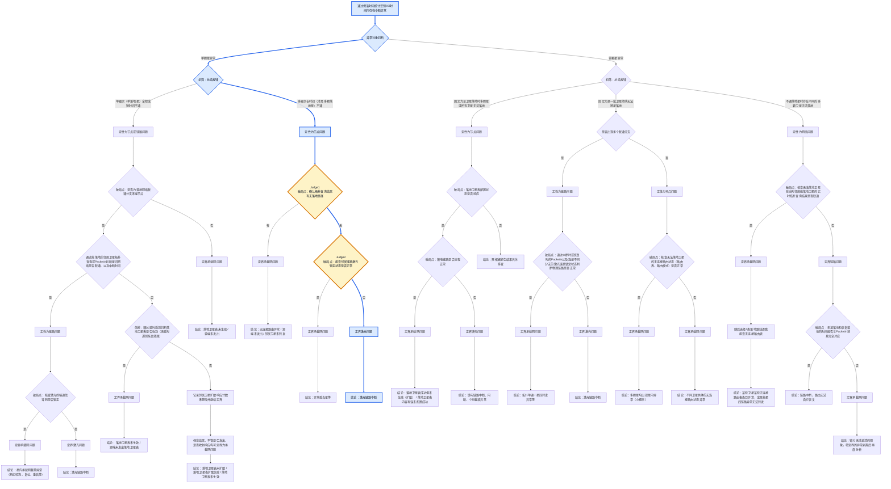

# 天基承载网故障排查报告

## 1. 事件概览

- Session：`sess_cc2c48f5`
- 事件ID：`INT-20260808T172000-90FE0ED90248`
- 中断时间：2026-08-08 17:20:00.000 至 2026-08-08 19:10:00.000
- 持续时间：6600.0 秒
- 影响卫星：A0504
- 初步类型：`single_sat_long`
- 分析状态：`completed`
- 报告生成时间：2026-09-22T21:27:46+08:00

## 2. 完整故障树与实际故障树分支

> 图例：蓝色节点和连线表示本次实际经过的分支；橙色节点表示已查询到有效数据并形成判据的关键判断节点（Judge）。未高亮部分为原故障树中本次未经过的分支。

实际路径：`A` → `B` → `C1` → `D2` → `E2/Judge1` → `F4/Judge2` → `H6` → `I5`

## 3. 关键证据（按 Judge 关联）

### Judge1 · E2 · 破局点：确认拓扑查询结果有无落地路径

- 判定结果：`path_missing`
- 后续节点：`F4`

#### 证据 `ev-0002`

- 证据ID：`ev-0002`
- 工具：`topology_query`
- 证据状态：`valid`
- 逻辑接入源：星地拓扑数据（`ground_link_topology`）
- 辅助/增量数据源：onboard_routing_table_snapshot（仿真增量观测表）、keepalive_landing_candidate（落地关联表）
- 查询参数：`{"affected_objects": ["A0504"], "end_time": "2026-08-08 19:10:00.000", "interruption_end_bdt": "2026-08-08 19:10:00.000", "interruption_start_bdt": "2026-08-08 17:20:00.000", "observation_bdt": "2026-08-08 17:20:00.000", "selected_event_id": "INT-20260808T172000-90FE0ED90248", "source_sat": "", "start_time": "2026-08-08 17:20:00.000", "target_station": "", "tree_node_id": "E2"}`
- outcome：`"path_missing"`
- route_snapshot_bdt：`"2026-08-08 17:00:00.000"`
- data记录数：1
- data代表记录：`[{"actual_landing_route": null, "satellite_id": "A0504"}]`

### Judge2 · F4 · 破局点：排查邻居链路激光锁定状态是否正常

- 判定结果：`abnormal`
- 后续节点：`H6`

#### 证据 `ev-0003`

- 证据ID：`ev-0003`
- 工具：`laser_link_query`
- 证据状态：`valid`
- 逻辑接入源：激光链路通断信息（`laser_link_event`）、激光遥测参数（`laser_telemetry`）、星间实时拓扑（`realtime_topology`）
- 辅助/增量数据源：topology_edge（拓扑明细表）
- 查询参数：`{"affected_objects": ["A0504"], "end_time": "2026-08-08 19:10:00.000", "interruption_end_bdt": "2026-08-08 19:10:00.000", "interruption_start_bdt": "2026-08-08 17:20:00.000", "observation_bdt": "2026-08-08 17:20:00.000", "selected_event_id": "INT-20260808T172000-90FE0ED90248", "source_sat": "", "start_time": "2026-08-08 17:20:00.000", "target_station": "", "tree_node_id": "F4"}`
- outcome：`"abnormal"`
- decision_basis：`"latest_link_event_and_both_endpoint_lock_telemetry"`
- observation_bdt：`"2026-08-08 17:20:00.000"`
- data记录数：1
- data代表记录：`[{"neighbor_link_observed": false, "source_satellite_id": "A0504"}]`

## 4. 其他证据与缺失证据

### ev-0001 · A · `keep_alive_query`

- 证据ID：`ev-0001`
- 工具：`keep_alive_query`
- 证据状态：`valid`
- 逻辑接入源：保活时间统计（`keepalive_statistics`）、星地拓扑数据（`ground_link_topology`）
- 辅助/增量数据源：v_keepalive_interruptions（查询视图）
- 查询参数：`{"end_time": "2026-08-09 00:00:00", "limit": 1000, "start_time": "2026-08-08 00:00:00"}`
- 数据库：`/Users/ypcj/GIT/troubleshooting_agent/data/sbc_simulation_20260808.db`
- anomaly：`true`
- pattern：`"multiple_sat_network"`
- data记录数：157
- data代表记录：`[{"keepalive_end_bdt": "2026-08-08 18:00:00.000", "keepalive_id": 1, "keepalive_start_bdt": "2026-08-08 00:00:00.000", "satellite_id": "A0101"}, {"keepalive_end_bdt": "2026-08-08 18:00:00.000", "keepalive_id": 4, "keepalive_start_bdt": "2026-08-08 00:00:00.000", "satellite_id": "A0102"}, {"keepalive_end_bdt": "2026-08-08 18:00:00.000", "keepalive_id": 7, "keepalive_start_bdt": "2026-08-08 00:00:00.000", "satellite_id": "A0103"}, {"keepalive_end_bdt": "2026-08-08 18:00:00.000", "keepalive_id": 10, "keepalive_start_bdt": "2026-08-08 00:00:00.000", "satellite_id": "A0104"}, {"keepalive_end_bdt": "2026-08-08 18:00:00.000", "keepalive_id": 13, "keepalive_start_bdt": "2026-08-08 00:00:00.000", "satellite_id": "A0105"}]`
- interruptions记录数：97
- interruptions代表记录：`[{"interruption_end_bdt": "2026-08-08 12:13:54.100", "interruption_seconds": 834.1, "interruption_start_bdt": "2026-08-08 12:00:00.000", "satellite_id": "A0603"}, {"interruption_end_bdt": "2026-08-08 14:26:22.331", "interruption_seconds": 6617.241, "interruption_start_bdt": "2026-08-08 12:36:05.090", "satellite_id": "A0603"}, {"interruption_end_bdt": "2026-08-08 15:00:00.000", "interruption_seconds": 994.508, "interruption_start_bdt": "2026-08-08 14:43:25.492", "satellite_id": "A0603"}, {"interruption_end_bdt": "2026-08-08 19:10:00.000", "interruption_seconds": 6600.0, "interruption_start_bdt": "2026-08-08 17:20:00.000", "satellite_id": "A0504"}, {"interruption_end_bdt": "2026-08-08 20:00:00.000", "interruption_seconds": 7200.0, "interruption_start_bdt": "2026-08-08 18:00:00.000", "satellite_id": "A0101"}]`
- candidate_events记录数：6
- candidate_events代表记录：`[{"duration_seconds": 834.1, "event_id": "INT-20260808T120000-F1639A334B88", "interruption_end_bdt": "2026-08-08 12:13:54.100", "interruption_start_bdt": "2026-08-08 12:00:00.000", "investigation_order": ["A0603"], "landing_satellites": ["A0308", "A0309", "A0604"], "pattern": "single_sat_long", "satellite_count": 1, "satellites": ["A0603"]}, {"duration_seconds": 6617.241, "event_id": "INT-20260808T123605-73556752D200", "interruption_end_bdt": "2026-08-08 14:26:22.331", "interruption_start_bdt": "2026-08-08 12:36:05.090", "investigation_order": ["A0603"], "landing_satellites": ["A0108", "A0301", "A0302", "A0304", "A0309", "A0407", "A0408", "A0601", "A0602", "A0605", "A0606", "A0609"], "pattern": "single_sat_long", "satellite_count": 1, "satellites": ["A0603"]}, {"duration_seconds": 994.508, "event_id": "INT-20260808T144325-993573E5C1AB", "interruption_end_bdt": "2026-08-08 15:00:00.000", "interruption_start_bdt": "2026-08-08 14:43:25.492", "investigation_order": ["A0603"], "landing_satellites": ["A0103", "A0405", "A0601"], "pattern": "single_sat_long", "satellite_count": 1, "satellites": ["A0603"]}, {"duration_seconds": 6600.0, "event_id": "INT-20260808T172000-90FE0ED90248", "interruption_end_bdt": "2026-08-08 19:10:00.000", "interruption_start_bdt": "2026-08-08 17:20:00.000", "investigation_order": ["A0504"], "landing_satellites": ["A0105", "A0107", "A0110", "A0201", "A0202", "A0204", "A0208", "A0209", "A0402", "A0403", "A0406", "A0407", "A0408", "A0409", "A0410", "A0505", "A0506", "A0507", "A0509"], "pattern": "single_sat_long", "satellite_count": 1, "satellites": ["A0504"]}, {"duration_seconds": 7200.0, "event_id": "INT-20260808T180000-5BC4A94039BF", "interruption_end_bdt": "2026-08-08 20:00:00.000", "interruption_start_bdt": "2026-08-08 18:00:00.000", "investigation_order": ["A0101", "A0102", "A0103", "A0104", "A0105", "A0106", "A0107", "A0108", "A0109", "A0110", "A0201", "A0202", "A0203", "A0204", "A0205", "A0206", "A0207", "A0208", "A0209", "A0210", "A0301", "A0302", "A0303", "A0304", "A0305", "A0306", "A0307", "A0308", "A0309", "A0310", "A0406", "A0506", "A0606"], "landing_satellites": ["A0107", "A0410"], "pattern": "fixed_sat_batch", "satellite_count": 33, "satellites": ["A0101", "A0102", "A0103", "A0104", "A0105", "A0106", "A0107", "A0108", "A0109", "A0110", "A0201", "A0202", "A0203", "A0204", "A0205", "A0206", "A0207", "A0208", "A0209", "A0210", "A0301", "A0302", "A0303", "A0304", "A0305", "A0306", "A0307", "A0308", "A0309", "A0310", "A0406", "A0506", "A0606"]}]`

## 5. 定界节点

- `H6`：定界激光问题

## 6. 初步结论

- **I5**：激光链路中断

### 模型辅助分析

**结论**：结构化状态为 `completed`。故障窗口 `2026-08-08 17:20:00—19:10:00`，受影响对象 `A0504`，当前节点 `I5`，结论为：**激光链路中断**。事件 ID：`INT-20260808T172000-90FE0ED90248`。

**实际分支**：  
`A 选择中断事件 → B/C1 分类为 single_sat_long → D2 定性为节点问题 → E2 断点 path_missing → F4 断点 abnormal → H6 边界“定界激光问题” → I5 结论“激光链路中断”`。  
断点/边界：`E2`、`F4`，边界节点 `H6`。

**关键证据**：  
- `ev-0002`：`topology_query`，A0504 `actual_landing_route=null`，`outcome=path_missing`。  
- `ev-0003`：`laser_link_query`，A0504 `neighbor_link_observed=false`，`outcome=abnormal`，依据 `latest_link_event_and_both_endpoint_lock_telemetry`。  
- `ev-0001`：`keep_alive_query`，异常为 `true`，模式为 `multiple_sat_network`，原始结果受影响对象包含 A0504；该证据在 structured_result 中支持 I5 结论。

**排除项与限制**：  
- 可依据 `ev-0002`、`ev-0003` 排除查询时刻“存在落地路由”和“邻居链路正常观测”的情形。  
- structured_result 未给出明确的其他排除项。遍历中 `B`、`C1`、`D2`、`H6` 无 `evidence_ids`，`I5` 在 traversal 中证据为空但 conclusions 列出 `ev-0001/ev-0002/ev-0003`。因此不能声称已完整排除所有非激光因素，如节点硬件、路由配置等；证据不足处需补充。

**置信度**：structured_result 未提供量化置信度。基于 `E2/F4` 关键断点证据有效、状态为 `completed`，对“激光链路中断”有直接证据支撑；但中间分类节点缺少证据，整体置信度受限，不能视为完全确定。

**下一步建议**：  
1. 复核 A0504 激光链路事件及两端锁定遥测，确认 `neighbor_link_observed=false` 与故障窗口一致。  
2. 检查 A0504 激光终端状态、指向/捕获跟踪、光功率、温控与电源。  
3. 若短时无法恢复，启用备份路由或链路切换，并持续监控 keep-alive。  
4. 补充 `B/C1/D2/H6` 分支判定证据，以增强“single_sat_long、节点问题、激光问题定界”的完整性。

## 7. 缺失数据与分析限制

- 未发现阻断本次判断的数据缺失。

## 8. 数据来源

- 故障树来自 `sbc_network_troubleshooting` Skill 中的当前权威 `yaml sbc-tree`。
- 实际路径、Judge 和证据关联来自SBC LangGraph结构化诊断JSON。
- 报告未重新查询数据库，也未修改故障树判断。
- 完整工具参数及原始查询结果请查看配套JSON工件。
